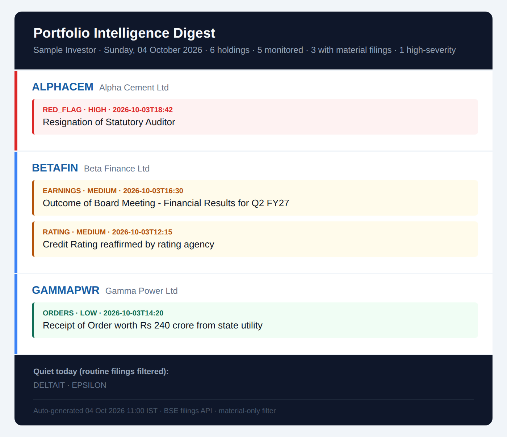

# Portfolio Filings Monitor

An unattended daily email digest for Indian equity investors, run by GitHub Actions at 07:00 IST. It watches every stock in a portfolio against BSE corporate filings, keeps only what is material, ranks it by severity and emails each user their own headline-first brief. No servers, no database, no paid data feeds.



*Sample output, rendered offline from fictional companies and filings by `examples/render_sample.py`. 8 raw filings in, 4 material filings out; the trading-window notice, newspaper ad, Reg 74(5) certificate and analyst-meet intimation are filtered as noise.*

---

## Design decisions

**The classification is deliberately rule-based, not AI.** A digest that decides whether an auditor resignation reaches an investor has to be exact, repeatable and auditable. Every filing is matched against explicit keyword lists, so for any email you can point to the precise rule that kept or dropped each line, and the same input always produces the same output. A language model would be faster to write and worse to trust: it can miss a red flag on a bad day and cannot tell you why.

- **Severity is a fixed table, not a score.** Category maps to HIGH / MEDIUM / LOW; there is no probabilistic ranking.
- **Red flags are checked before noise.** A HIGH match wins even if the headline also looks routine, so the filter fails towards over-reporting, never towards a silent miss.
- **Whole-word matching only** (`keywords.py`). Substring checks leak badly in filings text: `asm` would fire RED_FLAG on "enthusiasm". The known leak cases are pinned by regression tests.
- **Failures are loud.** A user whose holdings or email fails is skipped, the others still get their digest, and the run exits red so the owner is emailed.

AI was used as leverage to build this quickly. It is not in the runtime path.

---

## How it works

```
               07:00 IST (GitHub Actions cron, 01:30 UTC)
                                  |
                         portfolio_digest.py
                                  |
         portfolios/*.json --> Google Sheet CSV (live holdings)
                               fallback: inline holdings
                                  |
         BSE announcements API, 1 call per unique scrip across all users
                                  |
         materiality filter: RED_FLAG / MANAGEMENT / PLEDGE (HIGH),
         EARNINGS / CAPITAL / M&A / RATING / DIVIDEND (MEDIUM), ORDERS (LOW)
                                  |
                  one HTML email per user via Gmail SMTP
```

### Severity model

| Severity | Categories | Example triggers |
|---|---|---|
| HIGH | `RED_FLAG`, `MANAGEMENT`, `PLEDGE` | auditor resignation, fraud, default, NCLT/IBC, SEBI order, ASM/GSM, pledge invocation, CEO/CFO/MD exit |
| MEDIUM | `EARNINGS`, `DIVIDEND`, `CAPITAL`, `M&A`, `RATING` | results, buyback, QIP, rights, merger/demerger, rating action |
| LOW | `ORDERS` | order wins, LoIs, contracts |
| dropped | noise | trading window, Reg 74(5), newspaper ads, ESOP allotments, RTA changes, analyst meet intimations |

---

## Repository layout

```
portfolio_digest.py        BSE filings digest (multi-user)
keywords.py                whole-word keyword matcher
portfolios/
  _TEMPLATE.json           template for a new user
  sample.json              illustrative portfolio (not real holdings)
examples/render_sample.py  offline render on synthetic filings -> docs/sample-digest.html
tests/                     filter regression tests (no network)
.github/workflows/
  digest.yml               daily 07:00 IST + validates on portfolio edits
  tests.yml                pytest + sample render on every Python change
```

---

## Setup

### 1. Secrets and variables

Repo **Settings > Secrets and variables > Actions**:

| Name | Type | Required | Purpose |
|---|---|---|---|
| `GMAIL_APP_PASSWORD` | secret | yes | 16-char Gmail App Password (myaccount.google.com/apppasswords). Not your login password. |
| `GMAIL_SENDER` | variable | yes | Sending Gmail address. |

Without both, the scheduled run validates the portfolios and skips sending.

### 2. Add a user

Copy `portfolios/_TEMPLATE.json` to `portfolios/<name>.json`:

```json
{
  "name": "Friend Name",
  "email": "friend@example.com, optional-second@example.com",
  "sheet_csv_url": "",
  "holdings": [
    {"ticker": "RELIANCE", "name": "Reliance Industries Ltd", "bse_code": "500325", "qty": 10, "avg_price": 1300.00}
  ]
}
```

- **Live holdings (recommended):** publish a Google Sheet as CSV (File > Share > Publish to web > CSV) with header `ticker,name,bse_code,qty,avg_price[,note]` and paste the link into `sheet_csv_url`. Edit the sheet from your phone; the next run picks it up. Treat that link as private: anyone holding it can read the sheet.
- **Inline `holdings`** are the fallback if the sheet fetch fails. Keep a copy there; without it a Google outage skips that user for the day.
- `bse_code` must be numeric. Blank or non-numeric codes (ETFs, unlisted) are listed as "not monitored" in the email. Add a `note` to silence that.
- Files starting with `_` are ignored. Committing any change under `portfolios/` triggers a validation run (no email).
- `.gitignore` excludes every `portfolios/*.json` except the template and the sample. Real user files belong in a private fork.

---

## Running locally

```bash
pip install -r requirements.txt

python portfolio_digest.py --validate          # schema + sheet check, no BSE, no email
python portfolio_digest.py --dry-run           # writes digest_<user>.html, no email
python portfolio_digest.py --user sample --limit 5
python examples/render_sample.py               # offline sample, no network at all

pip install pytest && python -m pytest -q
```

Sending locally needs `GMAIL_SENDER` and `GMAIL_APP_PASSWORD` in the environment.

---

## Environment variables

| Variable | Default | Purpose |
|---|---|---|
| `GMAIL_SENDER` | none | sending address |
| `GMAIL_APP_PASSWORD` | none | Gmail App Password |
| `DIGEST_LOOKBACK_HOURS` | `26` | filing window (2h overlap absorbs cron delay) |

---

## Operational notes

- **BSE from datacenter IPs** works with browser headers; NSE does not, which is why BSE codes are the key.
- **Lookback is timestamp-based.** BSE's API filters by calendar date only, so filings are re-filtered on their IST timestamp to stop a 07:00 run re-reporting the previous night.
- **One fetch per unique scrip.** Five users holding the same stock cost one API call.
- **Times** are IST throughout; runners are UTC and the script converts.
